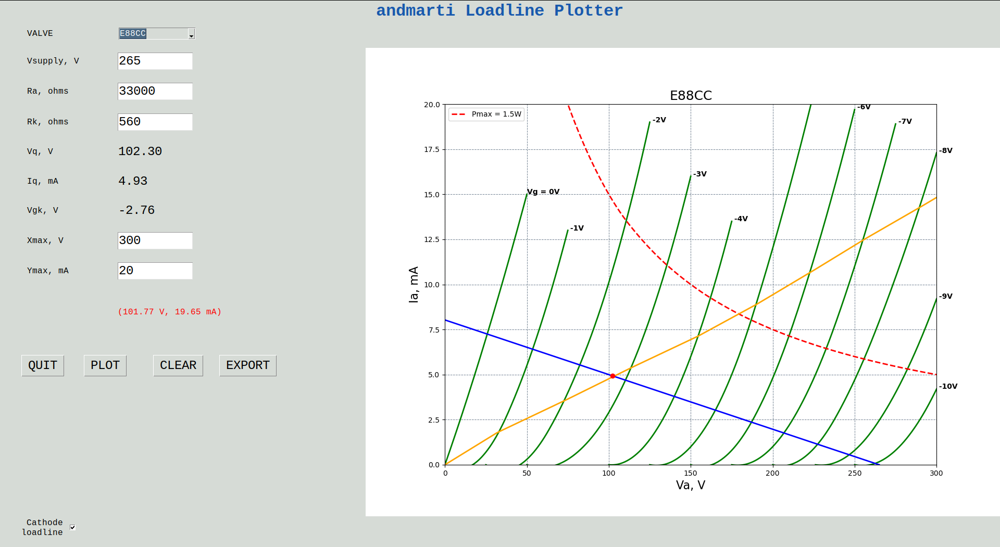

# loadline_plotter
## andmarti1424 Vacuum valves loadline plotter



This is a loadline plotter based on ideas taken from Merlin's Blencowe and VTADIY ones.
This is totally free for you to use it. License is GPLv3.

## Usage
```python plotter.py```

## Adding valves
Its easy to add new valves info. All you need is to specify curves data in the following format and add it to valves_data.csv:

```
#VALVE, GRIDCURVE, Xvalue, Yvalue, Xvalue2, Yvalue2, etc
E88CC, 0, 0, 0, 25, 7, 50, 15
E88CC, -1, 0, 0, 25, 0.7, 50, 5.5, 75, 13
E88CC, -2, 25, 0, 50, 0.3, 75, 4, 100, 10.1, 125, 19
E88CC, -3, 50, 0, 75, 0.3, 100, 2.9, 125, 8.1, 150, 16
E88CC, -4, 100, 0, 125, 1.4, 150, 6.0, 175, 13.5
E88CC, -5, 125, 0, 150, 1, 175, 5, 200, 12, 226.1, 21
E88CC, -6, 150, 0, 175, 0.8, 200, 4.8, 226.1, 11.7, 250, 19.7
E88CC, -7, 175, 0, 200, 1, 226.1, 5, 250, 11, 275, 18.9
E88CC, -8, 200, 0, 226.1, 1, 250, 4.7, 275, 10.4, 300, 17.3
E88CC, -9, 226.1, 0, 250, 0.8, 275, 4, 300, 9.2
E88CC, -10, 250, 0, 275, 0.8, 300, 4.2
E88CC, Pmax, 25, 60, 50, 30, 75, 20, 100, 15, 125, 12, 150, 10, 175, 8.571428571, 200, 7.5, 226.1, 6.63423264, 250, 6, 275, 5.454545455, 300, 5

and a register in valves_specs.csv file with these data:
valve, Pmax, VaMax, mu, ra, Cga, CgAEA, DefaultXmax, DefaultYmax
E88CC, 1.5, 220, 33, 2650, 1.4, 3.1, 300, 20
```

## Support
Want to help with the project?
Please submit 6AQ8 data or make a Patreon / Paypal donation.
Every dollar helps a lot! Thank you!
<a href="https://www.paypal.com/cgi-bin/webscr?cmd=_s-xclick&hosted_button_id=U537V8SNQQ45J" target="_blank">


## Requirements
 - `python`
 - `matplotlib`
 - `tkinter (tk)`

